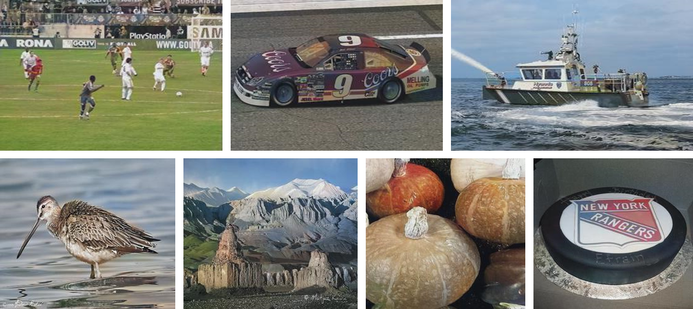

# Semantic-Colorization-GAN

We provide PyTorch implementations for Semantic Colorization with Generative Adversarial Networks. This work is to translate the color information from the given grayscale image. And we list full range of experiment results and comparisons to other works.

This page is for **IEEE Trans on CSVT Review Supplementary Material**.

## 1 Testing Examples

### 1.1 Colorization Results

We show the representative image of our system.

We provide a lot of results randomly selected from **ImageNet** and **MIT Place 365** validation datasets. These images contain multiple scenes and colors.

### 1.2 Comparison Results

The comparison results with other fully-automatic algorithms are:

The comparison results with other example-based algorithms are:

### 1.3 Ablation Study Results

There are six settings of our network to exclude some parts from original structure, and results are:

We further compare the results from InstanceNorm and different coefficients. Although InstanceNorm gives a better result on some images, while the statistical evaluation indexes are worth than BatchNorm. We also tried many settings of the hyper-parameters (15 types of combination), and found that **lambda_GAN = 0.1, lambda_Attn = 1, lambda_Percep = 5, and lambda_WGANGP = 10** are better combination for this network architecture and the training method. In some situation, **lambda_Percep = 20** is also good for better perceptual experience.

### 1.4 Examples of Semantic Confusion and Object Intervention Problems

We give some examples to illustrate the semantic confusion and object intervention problems intuitively. As Section 1.1 - 1.3 show, our system intergrates low-level and high-level semantic information and understands how to genrate a reasonable colorization. These settings / architectures help the main colorization network to **minimize the semantic confusion and object intervention problems**.

There is some examples of semantic confusion problem.

There is some examples of object intervention problem.

To further prove this point, we give more examples about generated attention region and how the saliency map works.

### 1.5 How our Model Learns at each Epoch

In order to prove our system has the strong fitting ability, we plot the evolution of results of multiple epochs of pre-training term and refinement term. We can see the CNN learns the high-level information at second term.

## 2 Legacy Image Colorization

### 2.1 Portrait Photographs

We choose several **famous legacy portrait photographs** in our experiments. The photographs chosen are with different race, gender, age, and scene. We also select a photo of Andy Lau, which represents the contemporary photographs.

### 2.2 Landscape Photographs

We choose many **landscape photographs** by Ansel Adams because the quality is so good. While these photographs are taken from US National Archives (Public Domain).

### 2.3 Famous Lagacy Photographs

In this section, we select some **famous photographs** (especially before 1950). And we give a color version of them.

### 2.4 Other Works

There are many fantastic **legacy photography works**. Our colorization system still predicts visually high-quality reasonable colorized images.

## 3 Getting Started

We will release the trained models and instructions after publication.

## 4 Failure Examples and Future Work

Examples of the most common failure cases. The proposed system is sensitive to small objects like complicated scene, special patterns, and details respectively in first row. There are 4 problems in second row: lack of color, inconsistent hue, inconsistent chroma, and color overlapping.

In the future, we will try to train on ImageNet and utilize more powerful regularizer. Especially, we want to further consider how to solve the small object sensitivity problem, maybe **Lab color space / new loss functions** will be utilized. Besides, as a **Pix2Pix translation task**, we also want to enhance this idea and **guide other similar tasks**, like style transfer, image inpainting, sketch2image, etc. We will try ro expend this model to give a selectable multi-model colorization.

## 5 NIR Image Colorization

If you would like to train SCGAN on NIR data, just change the **dataset setting**. We show some examples of NIR colorization:

## 6 Related Projects
**Automatic Colorization: [Project](https://tinyclouds.org/colorize/)
[Github](https://github.com/Armour/Automatic-Image-Colorization)**

**Learning Representations for Automatic Colorization: [Project](http://people.cs.uchicago.edu/~larsson/colorization/)
[Paper](https://arxiv.org/abs/1603.06668)
[Github](https://github.com/gustavla/autocolorize)**

**Colorful Image Colorization: [Project](http://richzhang.github.io/colorization/)
[Paper](https://arxiv.org/abs/1603.08511)
[Github](https://github.com/richzhang/colorization)**

**Let there be Color!: [Project](http://iizuka.cs.tsukuba.ac.jp/projects/colorization/en/)
[Paper](http://iizuka.cs.tsukuba.ac.jp/projects/colorization/data/colorization_sig2016.pdf)
[Github](https://github.com/satoshiiizuka/siggraph2016_colorization)**

**Pix2Pix: [Project](https://phillipi.github.io/pix2pix/)
[Paper](https://arxiv.org/pdf/1611.07004.pdf)
[Github](https://github.com/phillipi/pix2pix)**

**CycleGAN: [Project](https://junyanz.github.io/CycleGAN/)
[Paper](https://arxiv.org/pdf/1703.10593.pdf)
[Github](https://github.com/junyanz/CycleGAN)**
